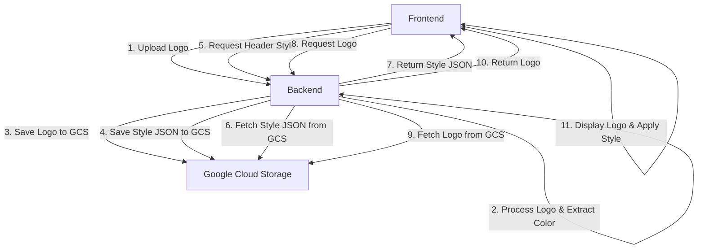

# Solution Design: Migrating Logo Storage to Google Cloud Storage

## Problem Statement

The HDFC Live Assistant application deployed on Cloud Run is experiencing an inconsistent header display issue. On each page refresh, the header shows different logos and styling - sometimes showing "OPTUS" with a teal background, and other times showing "HDFC BANK" with a blue background.

The root cause is that Cloud Run containers are stateless and ephemeral. Files written to the container's file system (like the logo.png and header_style.json) are not persisted between instances. When a container is replaced or scaled, the files are lost, and different page refreshes might be served by different container instances with different logos/styles.

## Solution Overview

We'll migrate the logo storage from the local file system to Google Cloud Storage (GCS), which provides persistent storage that can be accessed by all container instances. This will ensure consistent logo and styling across all instances of the application.

Here's a high-level overview of the solution:



## Detailed Solution Design

### 1. Backend Changes

#### 1.1. Add GCS Integration

First, we need to integrate Google Cloud Storage into the backend:

1. Add the Google Cloud Storage client library to `requirements.txt`
2. Create a GCS client in the backend application
3. Define constants for the GCS bucket name and logo folder path

#### 1.2. Modify Logo Upload Endpoint

Update the `/api/upload-logo` endpoint to:

1. Accept the logo file upload as before
2. Extract the dominant color as before
3. Upload the logo file to GCS instead of saving it locally
4. Create the header_style.json with the dominant color and a GCS-aware logo URL
5. Upload the header_style.json to GCS
6. Return success response with the GCS paths

#### 1.3. Modify Header Style Endpoint

Update the `/api/header-style` endpoint to:

1. Fetch the header_style.json from GCS instead of the local file system
2. If the file doesn't exist in GCS, return default styling as before
3. Return the header style JSON to the frontend

#### 1.4. Modify Logo Endpoint

Update the `/api/logo` endpoint to:

1. Fetch the logo.png from GCS instead of the local file system
2. Stream the logo file to the client
3. Handle errors appropriately (e.g., if the logo doesn't exist in GCS)

### 2. Frontend Changes

The frontend changes will be minimal since we're maintaining the same API endpoints:

1. No changes needed to the `LogoContext.js` file, as it will continue to fetch from the same endpoints
2. No changes needed to the `Header.js` component
3. No changes needed to the `LogoUploader.js` component

However, we should ensure that the frontend is properly handling error cases, such as when the logo or header style is not available.

## Implementation Plan

### Phase 1: Backend Modifications

1. **Add GCS Dependencies**
   - Add `google-cloud-storage` to `requirements.txt`

2. **Create GCS Utility Functions**
   - Create functions for uploading files to GCS
   - Create functions for downloading files from GCS
   - Create functions for checking if files exist in GCS

3. **Modify Logo Upload Endpoint**
   - Update the `/api/upload-logo` endpoint to use GCS

4. **Modify Header Style Endpoint**
   - Update the `/api/header-style` endpoint to fetch from GCS

5. **Modify Logo Endpoint**
   - Update the `/api/logo` endpoint to fetch from GCS

### Phase 2: Testing

1. **Local Testing**
   - Test the modified endpoints locally
   - Verify that logos are correctly uploaded to GCS
   - Verify that header styles are correctly stored in GCS
   - Verify that the frontend correctly displays the logo and applies the style

2. **Cloud Run Testing**
   - Deploy the modified backend to Cloud Run
   - Test logo uploads in the Cloud Run environment
   - Verify consistent header display across multiple page refreshes

### Phase 3: Deployment

1. **Backend Deployment**
   - Deploy the modified backend to Cloud Run
   - Verify that the service account has the necessary permissions to access GCS

2. **Frontend Deployment**
   - No changes needed to the frontend code
   - Deploy the frontend to Cloud Run as usual

## Technical Details

### GCS Integration Code

Here's a high-level overview of the GCS integration code:

```python
from google.cloud import storage

# Initialize GCS client
storage_client = storage.Client()

# Define constants
BUCKET_NAME = "bank-demo-sachin"
LOGO_FOLDER = "logos/"

def upload_file_to_gcs(local_file_path, gcs_file_name):
    """Upload a file to GCS."""
    bucket = storage_client.bucket(BUCKET_NAME)
    blob = bucket.blob(f"{LOGO_FOLDER}{gcs_file_name}")
    blob.upload_from_filename(local_file_path)
    return blob.name

def download_file_from_gcs(gcs_file_name, local_file_path):
    """Download a file from GCS."""
    bucket = storage_client.bucket(BUCKET_NAME)
    blob = bucket.blob(f"{LOGO_FOLDER}{gcs_file_name}")
    blob.download_to_filename(local_file_path)
    return local_file_path

def file_exists_in_gcs(gcs_file_name):
    """Check if a file exists in GCS."""
    bucket = storage_client.bucket(BUCKET_NAME)
    blob = bucket.blob(f"{LOGO_FOLDER}{gcs_file_name}")
    return blob.exists()

def get_file_from_gcs(gcs_file_name):
    """Get a file from GCS as bytes."""
    bucket = storage_client.bucket(BUCKET_NAME)
    blob = bucket.blob(f"{LOGO_FOLDER}{gcs_file_name}")
    return blob.download_as_bytes()
```

### Modified Endpoints

Here's a high-level overview of the modified endpoints:

```python
@app.route("/api/upload-logo", methods=["POST"])
async def upload_logo():
    """Handles logo file uploads and stores in GCS."""
    try:
        files = await request.files
        if 'logo' not in files:
            return jsonify({"error": "No logo file provided"}), 400

        file = files['logo']

        if file.filename == '':
            return jsonify({"error": "No selected file"}), 400

        if file:
            # Save file temporarily
            temp_filepath = os.path.join('/tmp', "temp_logo.png")
            await file.save(temp_filepath)

            # Extract dominant color
            hex_color = "#282c34"  # Default color
            try:
                colors, _ = extcolors.extract_from_path(temp_filepath)
                if colors:
                    dominant_color = colors[0][0]
                    hex_color = '#%02x%02x%02x' % dominant_color
            except Exception as color_exc:
                print(f"Error during color extraction: {color_exc}")

            # Upload logo to GCS
            gcs_logo_name = "logo.png"
            upload_file_to_gcs(temp_filepath, gcs_logo_name)

            # Save style info to GCS
            style_data = {
                "dominantColor": hex_color,
                "logoUrl": "/api/logo"
            }
            temp_style_filepath = os.path.join('/tmp', 'header_style.json')
            with open(temp_style_filepath, 'w', encoding='utf-8') as f:
                json.dump(style_data, f)
            
            # Upload style JSON to GCS
            gcs_style_name = "header_style.json"
            upload_file_to_gcs(temp_style_filepath, gcs_style_name)

            # Clean up temporary files
            os.remove(temp_filepath)
            os.remove(temp_style_filepath)

            return jsonify({"message": "Logo uploaded and style generated"}), 200
    except Exception as e:
        print(f"Error during logo upload: {e}")
        return jsonify({"error": "An internal error occurred"}), 500

@app.route("/api/header-style", methods=["GET"])
async def get_header_style():
    """Serves the header style JSON from GCS."""
    try:
        if file_exists_in_gcs("header_style.json"):
            style_data = get_file_from_gcs("header_style.json")
            return Response(style_data, mimetype='application/json')
        else:
            # Return a default style if the file doesn't exist
            return jsonify({
                "dominantColor": "#282c34",
                "logoUrl": "/api/logo"
            }), 200
    except Exception as e:
        print(f"Error fetching header style: {e}")
        return jsonify({"error": "An internal error occurred"}), 500

@app.route("/api/logo", methods=["GET"])
async def get_logo():
    """Serves the uploaded logo from GCS."""
    try:
        if file_exists_in_gcs("logo.png"):
            logo_data = get_file_from_gcs("logo.png")
            return Response(logo_data, mimetype='image/png')
        else:
            # If logo is not found, return a 404
            return jsonify({"error": "Logo not found"}), 404
    except Exception as e:
        print(f"Error fetching logo: {e}")
        return jsonify({"error": "An internal error occurred"}), 500
```

## Considerations and Edge Cases

1. **Error Handling**: The solution includes robust error handling for GCS operations, ensuring that failures are properly logged and appropriate error responses are returned to the client.

2. **Default Styling**: If the header_style.json file doesn't exist in GCS, the application will return default styling, ensuring that the application still functions even if no logo has been uploaded.

3. **Temporary Files**: The solution uses temporary files for processing, which are cleaned up after use to avoid filling up the container's file system.

4. **Service Account Authentication**: The solution relies on the existing service account configured for the Cloud Run service, which already has access to GCS.

5. **Consistent API Interface**: The solution maintains the same API endpoints, ensuring that the frontend doesn't need to be modified.

## Benefits of the Solution

1. **Consistency**: The logo and styling will be consistent across all container instances, eliminating the inconsistent header display issue.

2. **Scalability**: The solution will work correctly even as the application scales to multiple container instances.

3. **Persistence**: The logo and styling will persist even when containers are replaced or restarted.

4. **Minimal Changes**: The solution requires changes only to the backend code, with no changes needed to the frontend.

5. **Robustness**: The solution includes proper error handling and fallback mechanisms to ensure the application functions correctly even in edge cases.

## Implementation Notes

1. Always use the backend virtual environment before installing packages or running Python code.
2. The GCS bucket `bank-demo-sachin` with the folder `logos/` will be used for storing the logo and header style files.
3. The existing service account configured for the Cloud Run service already has access to GCS.